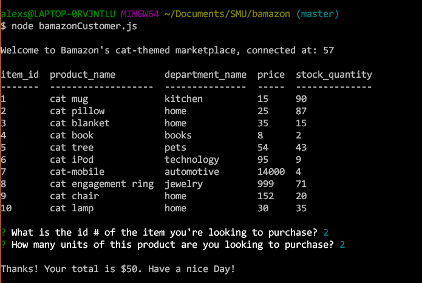
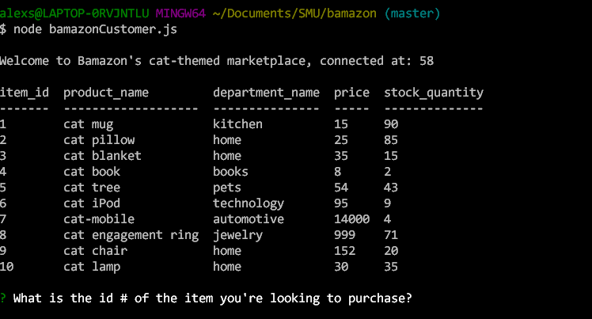

# bamazon

This Node.js CLI uses mySql and Javascript to create a basic eCommerce app. 
Watch the app in action here: https://youtu.be/r7S1iiTYdu4

First, the app queries the database and brings back info from the Bamazon storefront. Then, the user selects their desired item, and decides how many of that item they'd like to purchase. The app updates the database to reflect their purchase, and bids them a good day.

If you run the app again, you can see that the stock_quantity has, infact, updated.

